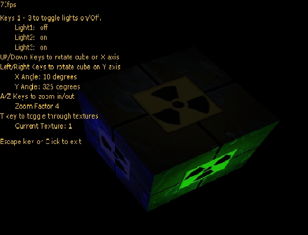



## A DirectX 8 Tutorial\!

### Description

This is a spinning 3D cube made using DirectX. It contains the following features:

-Zoom In/Out

-Change Textures

-Rotate 2 ways

-Turn on/off 3 different lights

-Enumerate hardware, display modes and device

-Change textures at runtime

I spent a good bit of time commenting it. Any votes are appreciated but what I really want is some feedback telling me what you think. If it goes well, I may upload and make more stuff like this.
 
### More Info
 

             |
---                |---
**Submitted On**   |2002-06-23 22:40:40
**By**             |[IRBMe](https://github.com/Planet-Source-Code/PSCIndex/blob/master/ByAuthor/irbme.md)
**Level**          |Intermediate
**User Rating**    |4.7 (104 globes from 22 users)
**Compatibility**  |VB 5\.0, VB 6\.0
**Category**       |[DirectX](https://github.com/Planet-Source-Code/PSCIndex/blob/master/ByCategory/directx__1-44.md)
**World**          |[Visual Basic](https://github.com/Planet-Source-Code/PSCIndex/blob/master/ByWorld/visual-basic.md)
**Archive File**   |[A\_DirectX\_985976252002\.zip](https://github.com/Planet-Source-Code/irbme-a-directx-8-tutorial__1-36251/archive/master.zip)

